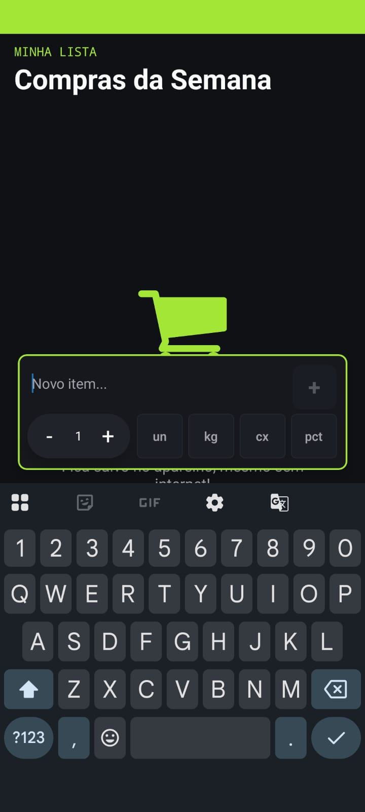
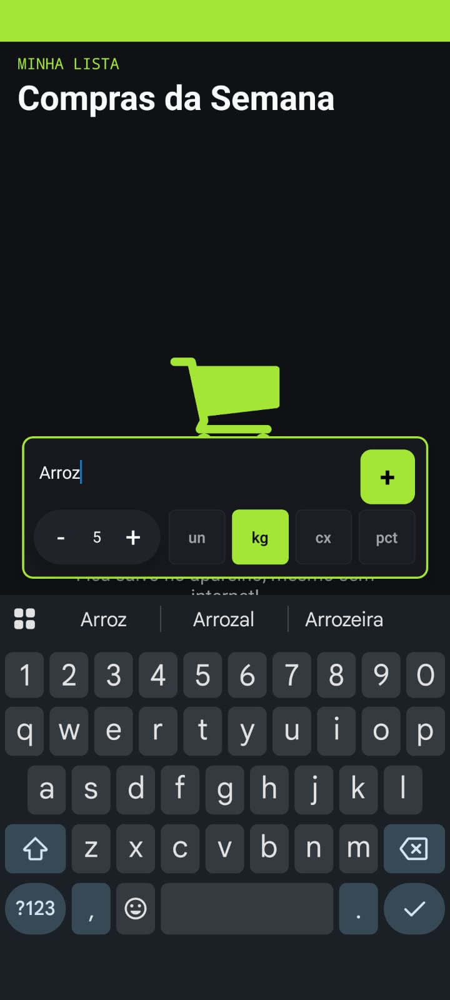
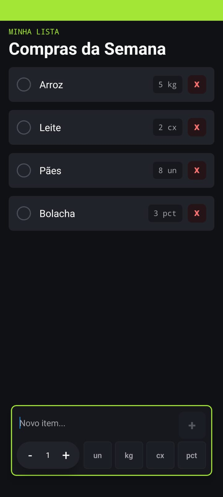
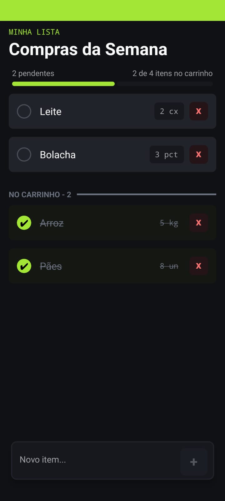

# Lista de Compras

Aplicativo desenvolvido por **Rafael dos Santos Sousa** para a disciplina de
**Programação Para Dispositivos Móveis**, utilizando **React Native** com Expo.

## Como executar no Expo Go

1. Instale o [Node.js](https://nodejs.org/) e o [Expo Go](https://expo.dev/go) no celular.

2. Clone este repositório e entre na pasta do projeto

3. Instale as dependências:

   ```bash
   npm install
   ```

4. Inicie o Expo:

   ```bash
   npx expo start
   ```

5. Com o celular e o computador na mesma rede Wi-Fi, escaneie o QR Code exibido no terminal usando o Expo Go. No Android, use a opção de leitura de QR Code do próprio Expo Go; no iPhone, use a câmera do sistema.

## Capturas de tela

### Lista vazia


### Barra em foco



### Preenchendo valores



### Lista populada



### Itens marcados


